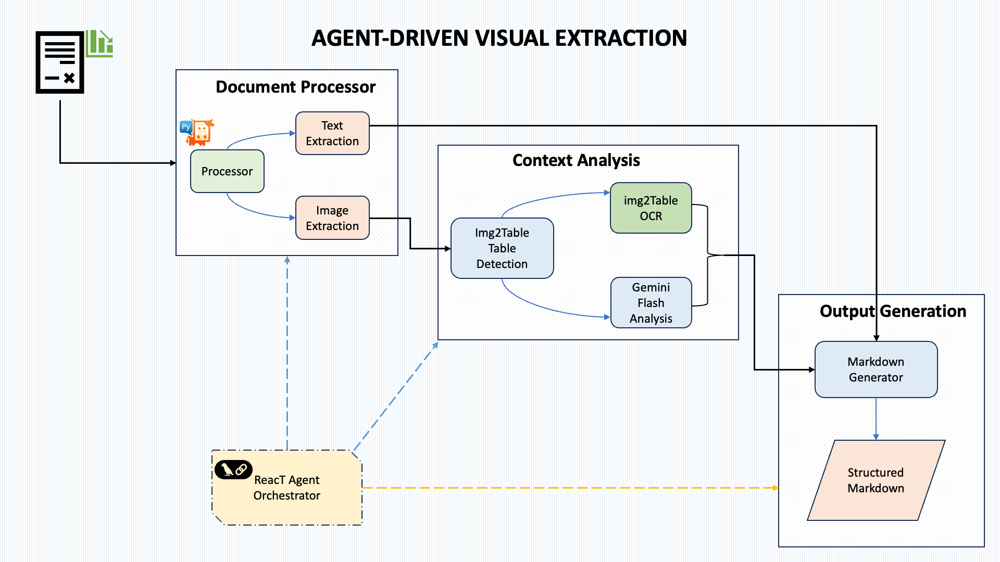

# Graphscribe

Graphscribe is an intelligent, LLM-powered document understanding system designed to extract structured insights from complex visual content such as statistical diagrams, charts, and graphs.

## Features

- Processes PDFs with charts/diagrams and tables
- Handles PNG and JPG image files
- Uses Gemini Flash 2.5 for multimodal analysis
- Uses img2table for advanced table detection and extraction
- Converts visual data into structured Markdown tables
- ReAct-based agent architecture for intelligent extraction
- Web interface built with Streamlit for easy document processing

## Architecture Blueprint



## Live Demo


## Setup

1. **Install Dependencies:**

```bash
pip install -r requirements.txt
```

2. **API Key Setup:**

Copy the `.env.example` file to `.env` and add your Google API key:

```
GOOGLE_API_KEY=your_api_key_here
```

You can obtain a Google API key from the [Google AI Studio](https://ai.google.dev/).

## Usage

### Web Interface

Run the Streamlit app:

```bash
streamlit run app.py
```

This will start the Graphscribe web interface where you can:
- Upload PDF or image files
- Preview the document
- Process to extract tables from charts
- Compare original charts with extracted tables
- Download the results as Markdown

### Command Line Interface

Process a PDF or image file:

```bash
python process_document.py path/to/your/document.pdf
```

This will create a file named `document_output.md` in the output directory.

Specify an output file:

```bash
python process_document.py path/to/your/document.pdf -o output.md
```

### Supported File Types

- PDF (`.pdf`)
- PNG (`.png`)
- JPG/JPEG (`.jpg`, `.jpeg`)

## Architecture

Graphscribe follows a modular architecture:

1. **Document Parser**: Extracts text and images from PDFs using PyMuPDF
2. **Chart Detection**: Identifies charts and diagrams using both PyMuPDF and img2table
3. **Table Extraction**: Uses img2table to detect and extract tabular data
4. **Chart Analysis**: Uses Gemini Flash 2.5 to analyze charts and generate tables
5. **ReAct-based Agent**: Orchestrates the extraction process for modular, scalable execution
6. **Markdown Generator**: Formats the extracted data into a structured document

## How It Works

1. For PDFs:
   - A ReAct-based agent orchestrates the entire extraction process
   - Text is directly extracted from the PDF using PyMuPDF
   - Tables are detected and extracted using img2table
   - Charts and diagrams are identified using PyMuPDF's path detection
   - Each chart is analyzed to generate a description and data table
   - The agent combines all results into a structured document

2. For standalone images:
   - First attempts to extract tables using img2table
   - If no tables are found, analyzes the image with Gemini to extract chart data
   - Results are saved in Markdown format

## Smart Chart Detection

The system uses multiple methods to identify charts and diagrams:

- **PyMuPDF Path Detection**: Identifies vector-based charts by their drawing paths
- **Large Image Detection**: Finds rasterized charts based on size and complexity
- **img2table Integration**: Uses img2table's advanced table recognition algorithms
- **Format Conversion**: Ensures all images are in compatible formats for processing

## Agent Architecture

Graphscribe uses a ReAct-based agent approach:

- **LLM Reasoning**: For visual-to-tabular conversion
- **Agent Execution**: For modular, scalable orchestration
- **Tool Selection**: Chooses between text extraction, table extraction, and chart analysis
- **Smart Batching**: Processes images in controlled batches to respect API quotas

## API Quota Management

To avoid hitting API rate limits, the system implements:

- **Batch Processing**: Images are processed in small batches (3 at a time)
- **Automatic Retries**: If a rate limit is hit, the system will retry after a delay
- **Timeouts**: API calls have timeouts to prevent hanging on slow requests
- **Error Recovery**: When table generation fails, the system still returns the image description

## Output Files

The extraction process produces two types of output:

1. **Markdown File**: The main output containing the extracted tables and text
2. **Extracted Images**: Charts and diagrams from PDFs are saved in the `extracted_images/<pdf_name>/charts/` directory for reference

This allows you to:
- See which charts were extracted from the document
- Review the source material used for table extraction
- Use the extracted images for other purposes if needed

## Troubleshooting

- **API Key Issues**: Ensure your Gemini API key is correctly set in the `.env` file
- **PDF Processing**: Make sure you have the required dependencies for PDF processing
- **Rate Limiting**: If you see rate limit errors, the system will retry automatically
- **Large Files**: Very large PDFs with many images will be processed in batches
- **Agent Iterations**: The agent is configured with a higher iteration limit (15) for complex documents

## Third-party Libraries

This project uses the following open-source libraries:

- [img2table](https://github.com/xavctn/img2table): Table identification and extraction library for PDF and images
- [PyMuPDF](https://github.com/pymupdf/PyMuPDF): PDF processing library
- [Streamlit](https://streamlit.io/): Framework for building the web interface
- [Google Generative AI](https://ai.google.dev/): API for accessing Gemini models 
